# 프롬프트 처리 흐름 (위임 강제 폐지 이후)

> 작성일: 2026-05-22
> 적용 범위: hoodcat-harness가 사용자 프롬프트를 받는 시점부터 워커가 실제 작업을 수행하기까지의 전체 흐름.
> 정본 위치: 본 문서. 구조 변경 시 본 문서를 먼저 갱신한다.
> 자신감 라벨: 확실 (현재 main의 실파일 — `harness.md`, `.claude/dispatch/{catalog,recipes,pushback-trigger}.md`, `CLAUDE.md`, `.claude/skills/*/SKILL.md`, `.claude/settings.json` — 직접 확인 기반. Tier 1. 옵션 X(2026-05-22)로 `orchestrator.md` 및 `orchestrator/examples.md` 제거됨.)

## 1. 핵심 구조 한눈에

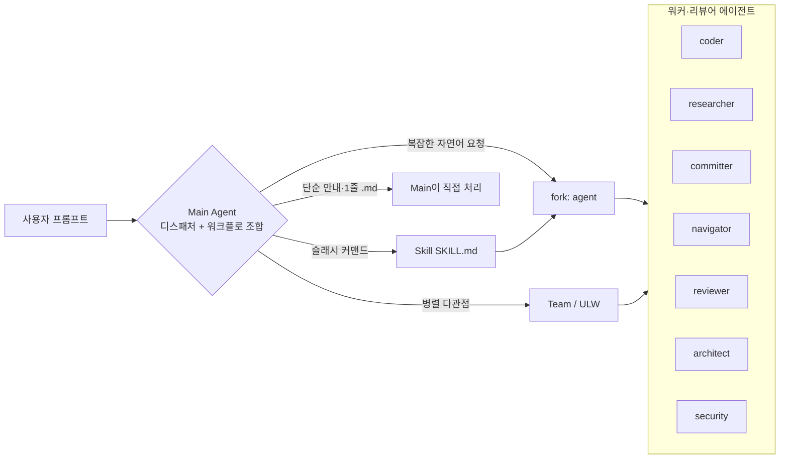

**옵션 A (2026-05-22) 이후의 핵심 변경**

| 항목 | 폐지 전 | 폐지 후 |
|---|---|---|
| PreToolUse Edit\|Write 훅 | 차단 (enforce-delegation.sh) | 없음 |
| ABSOLUTE RULES (FORBIDDEN/REQUIRED) | 강제 | 없음 |
| Review Agent Activation | 3+ 파일·보안 시 reviewer 의무 | 권고 |
| Self-Check 표 | 위임 전 5문항 자가 점검 의무 | 없음 (모델 자율) |
| 글로벌 권고 (`~/.claude/CLAUDE.md`) | "delegate, don't code" | 그대로 유지 |
| 위임 권고 (`harness.md` / `CLAUDE.md`) | 강제 | 단순 안내 |
| Orchestrator 메타 워커 | 존재 (2-tier) | 제거됨 (옵션 X, 2026-05-22) — Main이 직접 조합 (1-tier) |

---

## 2. 케이스별 처리 흐름

### 케이스 A: 슬래시 커맨드 직접 호출

사용자가 `/code`, `/test`, `/commit`, `/blueprint`, `/deepresearch`, `/decide` 등을 명시적으로 호출한 경우. Main Agent는 디스패처지만 슬래시 커맨드는 Claude Code 자체가 해석한다.

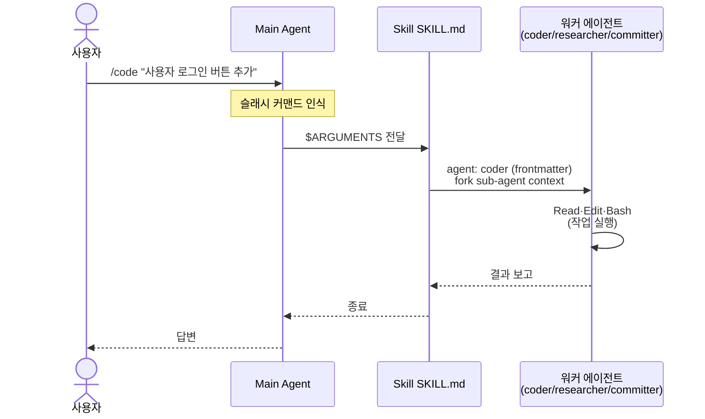

**관련 파일**:
- `.claude/skills/{name}/SKILL.md` — frontmatter `agent:` 필드가 fork 대상 결정
- SKILL.md 본문이 워커에게 전달되는 프로세스 명세

### 케이스 B: 자연어 요청 → Main Agent 직접 워크플로 조합 (디스패치 경로)

복잡하거나 모호한 자연어 요청. Main Agent가 `.claude/dispatch/catalog.md`·`recipes.md`를 참조해 직접 워크플로를 조합하고 워커를 호출한다 (Orchestrator 에이전트 없음, 옵션 X 2026-05-22).

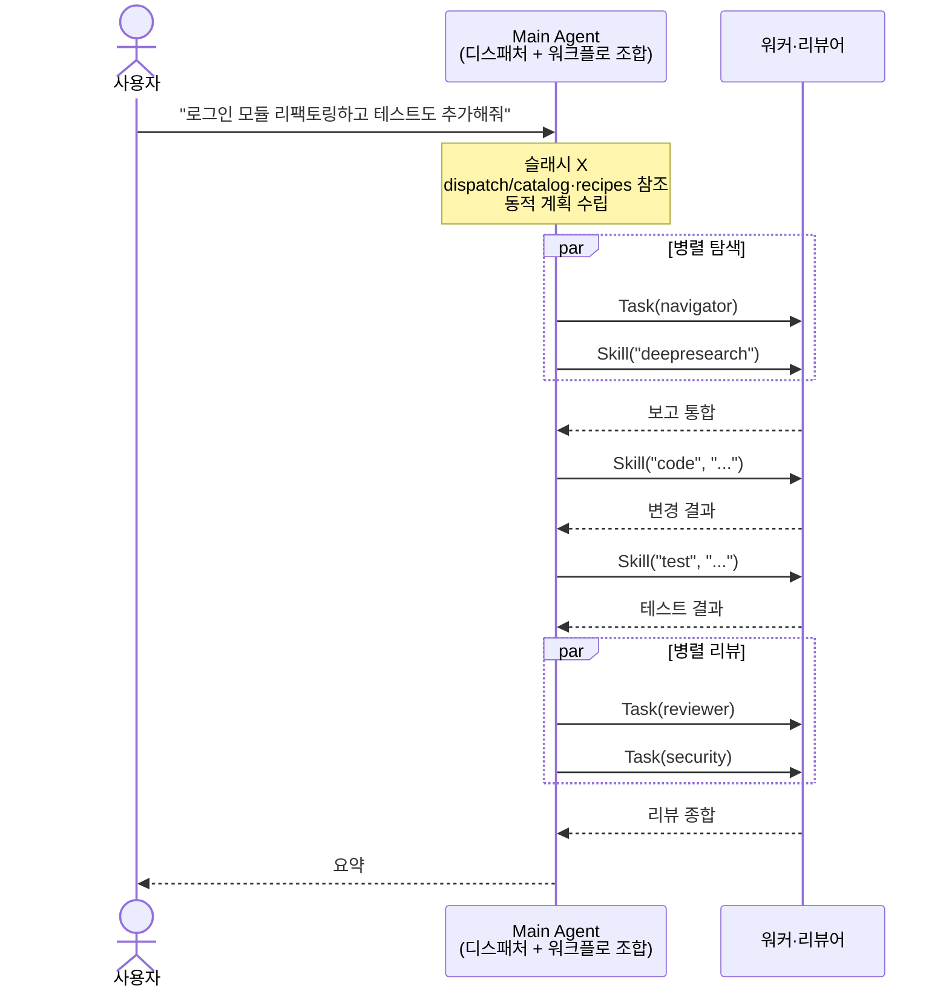

**관련 파일**:
- `.claude/dispatch/catalog.md` — Skill·Agent 카탈로그 + OMC 매핑
- `.claude/dispatch/recipes.md` — Feature/Bug Fix/Hotfix/New Project/Code Improvement/Harness Maintenance + 병렬 패턴

### 케이스 C: 단순 안내·1줄 .md 수정 (Main Agent가 직접 처리)

옵션 A 이후 허용된 케이스. 위임 오버헤드가 변경량보다 큰 경우 직접 처리.

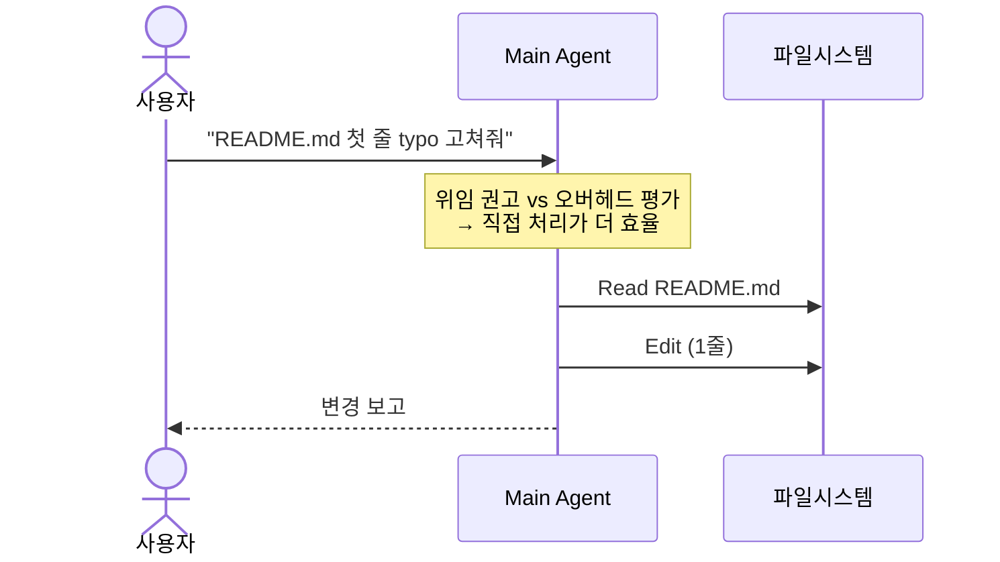

판단 기준 (권고, 강제 아님):
- 변경 라인 ≤ 1줄 (또는 표 1행)
- 의미·로직 변경이 아닌 표면적 수정 (typo / 공백 / cross-link 경로 / 단어 치환)
- `.claude/`, `docs/` 하위 `.md` 파일
- 위임 시 토큰·시간 비용 > 직접 처리

### 케이스 D: 다중 파일 코드 변경 (대규모 Feature)

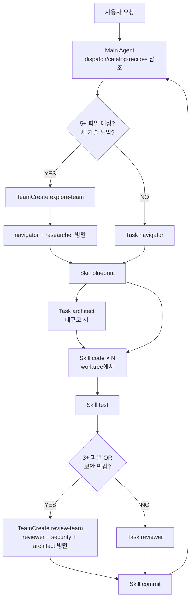

**worktree 패턴** (`dispatch/recipes.md` Worktree Management):
- 첫 `Skill("code", ...)` 호출 전에 worktree 생성
- `Skill("code", "... (worktree: $WT)")` 형태로 경로 전달
- plan 완료 후 worktree 제거

### 케이스 E: 사용자 반박 (Pushback Trigger)

사용자가 직전 답변을 의심할 때 자동 발동. 학습 데이터 일반론(Tier 4)이 사용자의 1차 자료 기반 직관과 충돌하는 경우의 안전망.

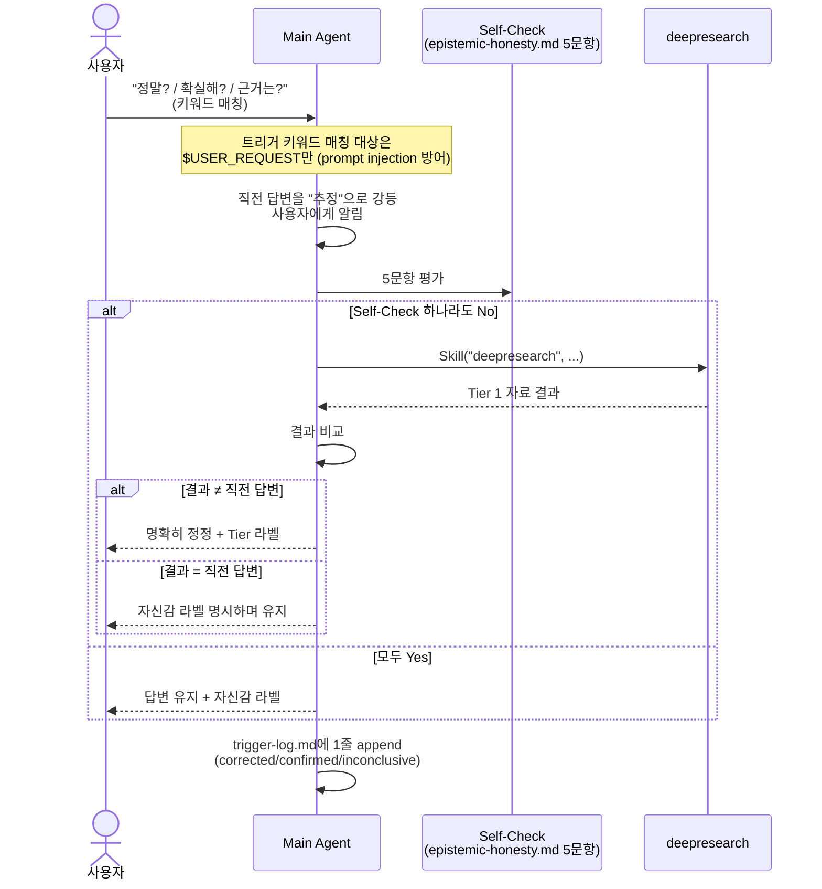

**키워드** (한국어): `정말`, `확실`, `진짜`, `맞아`, `다시 확인`, `다시 조사`, `근거`, `공고문`, `원문`, `1차 자료`
**키워드** (영어): `really`, `sure`, `verify`, `confirm`, `source`, `evidence`, `primary source`, `original`

**관련 파일**:
- `.claude/dispatch/pushback-trigger.md` — 트리거 로직 정본 (옵션 X 이전 후 위치)
- `.claude/rules/epistemic-honesty.md` — Self-Check 5문항 정본
- `.claude/rules/source-hierarchy.md` — Tier 1~4 분류
- `.claude/agent-memory/main/trigger-log.md` — 발동 통계 (PII 금지)
- `.claude/agent-memory/main/lessons-learned.md` — corrected 사례 누적

### 케이스 F: /goal 자율 루프

Claude Code 2.1.139의 `/goal "<완료 조건>"`. 명시적·객관적 종료 조건이 충족될 때까지 여러 턴 자동 실행.

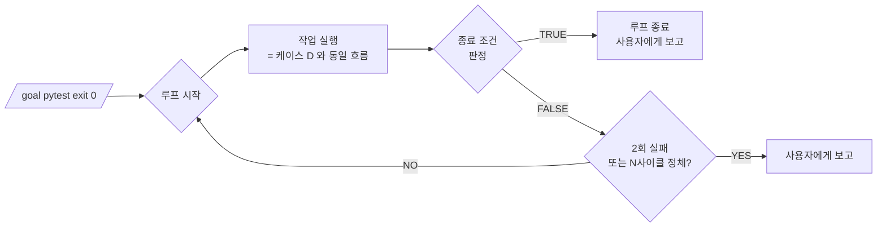

**적합한 종료 조건** (예시):
- `pytest -x exit 0`
- `tsc --noEmit 에러 0개`
- `dist/main.js 파일 존재`
- `eslint . exit 0`

**부적합** (사용 금지): "코드가 좋아질 때까지", "적당히 리팩토링" 같은 주관적 조건.

### 케이스 G: 병렬 작업 (ULW 패턴 / TeamCreate)

같은 응답 안에서 여러 `Agent()` / `Task()` / `Skill()` 호출을 동시 발사하면 자동 병렬 실행.

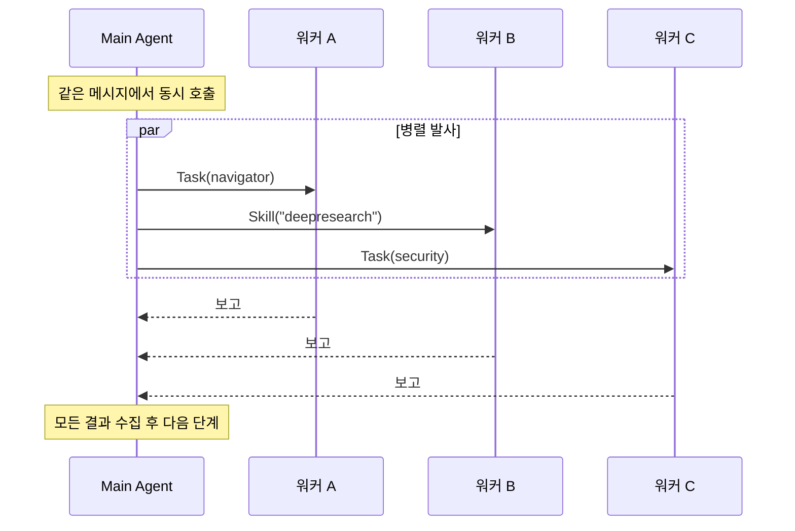

**판단 기준** (`dispatch/catalog.md` Parallel Invocation):
- 입력이 독립적 (서로의 출력을 필요로 하지 않음)
- 같은 파일을 동시 수정하지 않음 (읽기는 무관)

**TeamCreate 변형**: 런타임에서 동시 실행을 강제. `team-review`, `qa-swarm`, `TeamExplore`, `TeamReview` 패턴.

---

## 3. 의사결정 흐름 (요약)

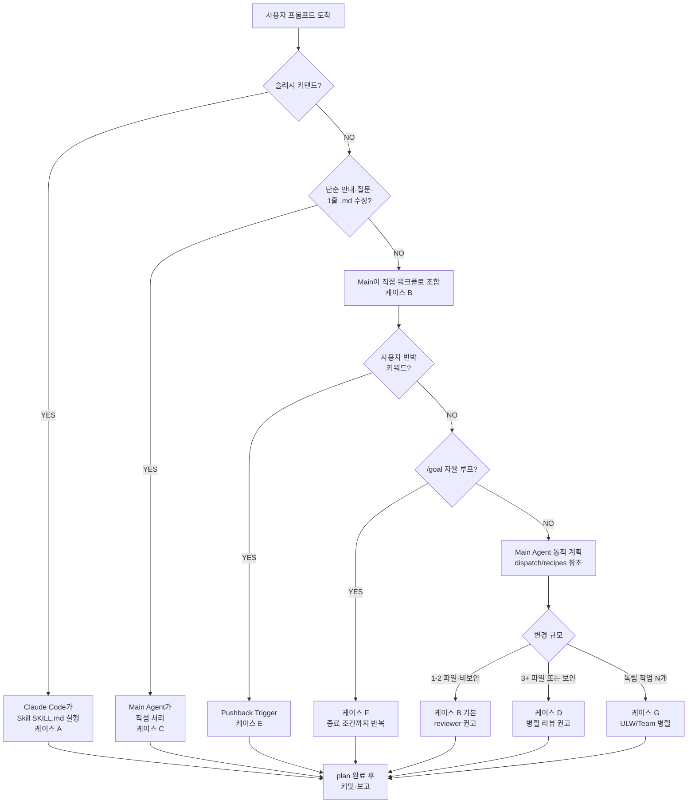

---

## 4. 개선 전후 비교

### 4.1 동일 시나리오: "src/auth/login.ts에 typo 1줄 수정해줘"

**개선 전 (위임 강제 시스템)**:

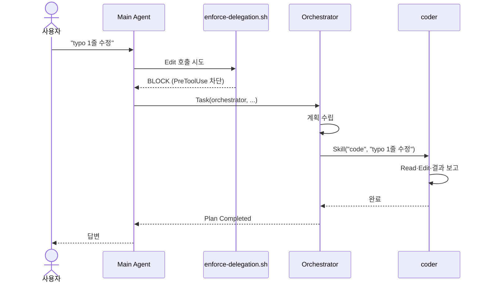
오버헤드: orchestrator fork + coder fork + 보고 왕복 ≈ 5단계.

**개선 후 (옵션 A)**:

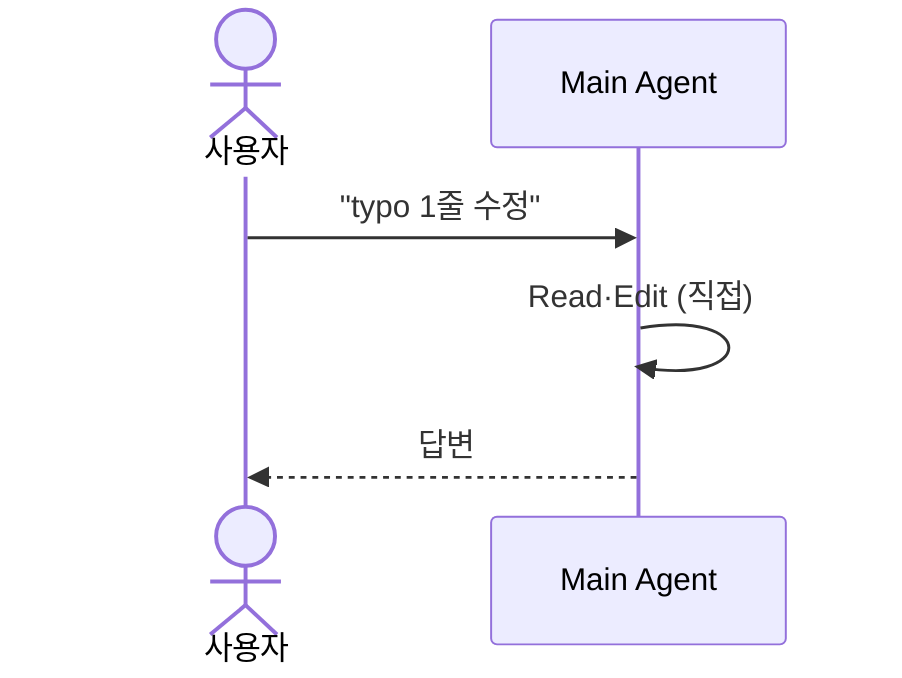
오버헤드: 1단계.

### 4.2 동일 시나리오: "auth 모듈 3개 파일 리팩토링 + 회귀 테스트"

**개선 전**: 위임 강제로 무조건 Skill 위임 → 본 케이스는 자연스럽게 적합.
**개선 후**: 권고이긴 하지만 모델이 같은 결론(위임)에 도달. **흐름 동일.**

규모가 큰 작업은 옵션 A 이후에도 자연 위임 (모델 판단 + 글로벌 권고). 강제 vs 권고의 차이가 **작은 변경에서만** 발생.

### 4.3 신뢰도 관점

| 항목 | 강제 시스템 | 권고 시스템 (옵션 A) |
|---|---|---|
| 위임율 (큰 변경) | 100% | ~100% (자연 위임) |
| 위임율 (작은 변경) | 100% (오버헤드 큼) | 모델 판단 — 효율적 |
| 안전망 | 물리적 차단 | 글로벌 권고 + Self-Check on Pushback |
| OMC 전환 호환 | enforce-delegation 회귀 테스트 필요 | 부담 0 |
| 회귀 리스크 | 차단 오류 시 정당 위임도 차단 가능 | 모델 판단 오류 시 작은 변경에 영향 (제한적) |

---

## 5. 추가 참고

- 카탈로그·레시피·트리거 상세 (옵션 X 이후 위치):
  - `.claude/dispatch/catalog.md`
  - `.claude/dispatch/recipes.md`
  - `.claude/dispatch/pushback-trigger.md`
  - ~~`.claude/agents/orchestrator/examples.md`~~ — 옵션 X (2026-05-22) 삭제됨
- 공통 룰 정본:
  - `.claude/rules/response-format.md`
  - `.claude/rules/shared-context-protocol.md`
  - `.claude/rules/agent-memory.md`
  - `.claude/rules/epistemic-honesty.md`
  - `.claude/rules/source-hierarchy.md`
  - `.claude/rules/antipatterns-{general,python,typescript}.md`
- OMC 전환:
  - `docs/migration-omc-mapping-20260522.md`
  - `.claude/settings-omc.json.example`
- 진행 상황:
  - `TODO.md` ("오케스트레이터 위임율 개선" 종결 절 + Phase 5+ 운영 검증 항목)
